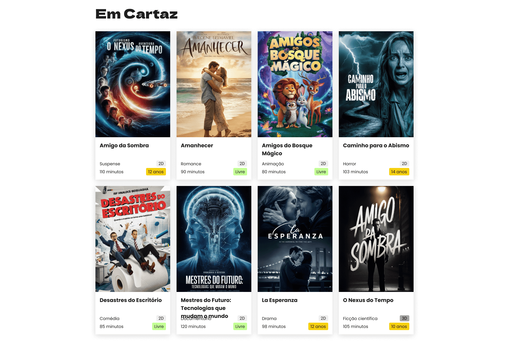

# 🎥 Luz e Cena

Landing page de um site focado em cinema, que exibe os filmes em cartaz e que ainda vão estrear permitindo selecionar localidade, buscar filmes pelo título, se inscrever para receber informações e muito mais.

## 📝 Sobre o Projeto

A página possui um cabeçalho, um banner, uma lista de filmes, uma seção de newsletter e um rodapé. Os filmes são retornados de uma API's local usando o JSON server. Possui a funcionalidade de filtrar os filmes no campo de busca por título.

<p align="center">
  
  
</p>

## 🛠️ Técnicas e tecnologias utilizadas

As técnicas e tecnologias utilizadas pra isso são:

- `React`: principal biblioteca para construção da interface
- `Typescript`: para adicionar tipagem estática na aplicação
- `Figma`: Protótipo de design da página
- `JSON server`: para simular uma api local
- `classnames`: para lidar com classes CSS e estilização dinâmica
- `react-icons`: biblioteca de ícones do React
- `CSS modules`: para escrever css no React

## 📁 Acesso ao projeto

Você pode [acessar o código fonte do projeto inicial](https://github.com/NeiltonSeguins/4472-react-ts) ou [baixá-lo](https://github.com/NeiltonSeguins/4472-react-ts/archive/refs/heads/aula-01.zip). Se você quiser acessar o figma do projeto, só [clicar neste link](https://www.figma.com/community/file/1464265240934231932).

## 💻 Como usar
### ☁️Clonar o repositório:
1. Para usar a aplicação, clone o repositório em seu ambiente local, você pode fazer isso executando o seguinte comando no terminal: git clone https://github.com/GGasparotto-code/Luz-e-Cena.git;

### ⬇️Fazendo o download do repositório:
1. Clique no botão "Code" neste repositório e faça o download;
2. Salve o arquivo ZIP em seu computador e descompacte-o;
3. Abra a pasta descompactada no VS Code. Para isso, siga os passos abaixo:

> - **File > Open Folder** (ou uma opção similar).
> - Procure o local onde o projeto foi salvo e selecione a pasta (se o projeto foi baixado como um arquivo ZIP, será necessário extraí-lo antes).
> - Clique em **OK**.

## ▶️ Executar o projeto
Para rodar o projeto, será necessário executar os seguintes comandos:

1. Instalação das Dependências:
Primeiro, você precisa instalar todas as dependências do projeto. Abra o terminal na pasta raiz do projeto e execute:
> ```npm install```

2. Executar o Backend (JSON Server):
O projeto utiliza o json-server para simular uma API REST. Se você ainda não o tem instalado, execute o comando abaixo globalmente:
> ```npm install -g json-server```

Em seguida, inicie o servidor na porta 3001 para que o front-end possa se conectar. Mantenha este terminal aberto enquanto estiver usando a aplicação.
> ```json-server --watch db.json --port 3001```

3. Executar o Frontend (React com Vite)
Abra um novo terminal na pasta raiz do projeto. Agora, inicie a aplicação React:
> ```npm run dev```

A aplicação será iniciada e você poderá acessá-la em seu navegador através do endereço http://localhost:5173 (ou a porta que o Vite indicar).
